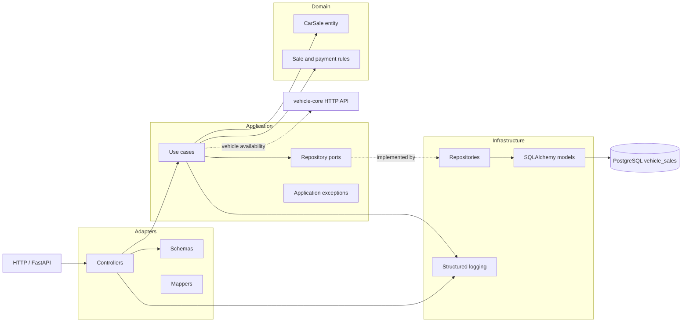
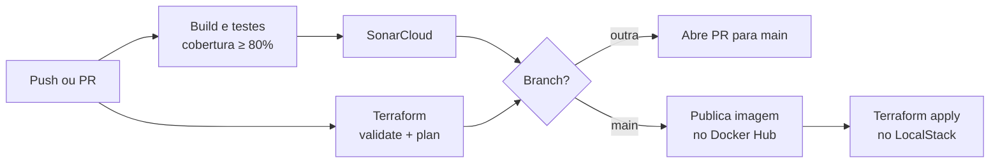

  
# vehicle-sales

Serviço de venda de veículos, com API Python, PostgreSQL e LocalStack.

## Arquitetura em camadas

A comunicação com o `vehicle-core` acontece por HTTP. O serviço de vendas deve
manter seu banco isolado e não acessar diretamente as tabelas do serviço
principal. As pastas de adapters e application já estão preparadas para os
casos de uso de compra, listagem e webhook de pagamento.

## CI/CD

O CI roda em pushes para qualquer branch e em PRs para `main`:

- build e testes, com cobertura mínima de 80%;
- análise no SonarCloud, que bloqueia a alteração se o quality gate falhar;
- `terraform fmt`, `validate` e `plan`, sem apply.

Se o CI passar:

- **em outra branch**, um PR para `main` é aberto automaticamente;
- **na `main`**, o CD publica a imagem no Docker Hub e aplica o Terraform no
  LocalStack Cloud.

Os jobs usam os workflows reutilizáveis de `fiap-soat-grupo36/reusable-actions`.
