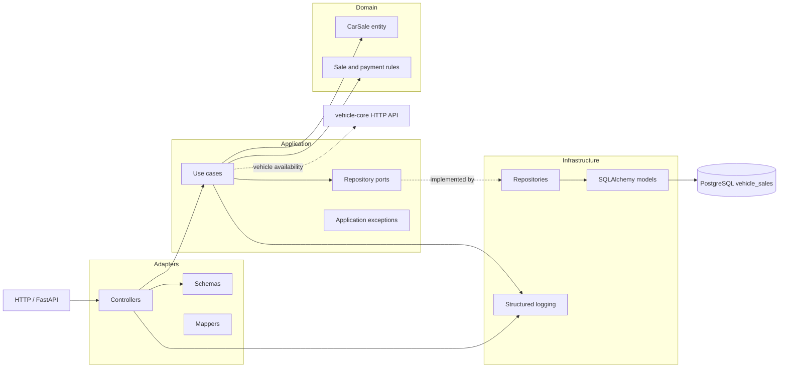

  
# vehicle-sales

Serviço de venda de veículos, com API Python, PostgreSQL e LocalStack.

## Arquitetura em camadas

A comunicação com o `vehicle-core` acontece por HTTP. O serviço de vendas deve
manter seu banco isolado e não acessar diretamente as tabelas do serviço
principal. As pastas de adapters e application já estão preparadas para os
casos de uso de compra, listagem e webhook de pagamento.

## CI/CD

O CI executa build Python, testes com cobertura mínima de 80%, análise SonarCloud,
validação Terraform e `terraform plan` sem apply. Em branches diferentes de
`main`, um Pull Request é criado automaticamente após o CI bem-sucedido.

O CD é acionado somente após o workflow `CI` terminar com sucesso na branch
`main`. Ele publica a imagem `app` no Docker Hub e depois aplica o Terraform no
LocalStack Cloud.

Workflows reutilizáveis usados:

- `_reusable-build-python.yml`
- `_reusable-sonar-python.yml`
- `_reusable-dockerhub.yml`
- `_reusable-terraform.yml`
- `_reusable-create-pr.yml`

Configure no GitHub:

- Repository variable `SONAR_ORG`
- Repository variable `DOCKERHUB_USERNAME`
- Secret `SONAR_TOKEN`
- Secret `DOCKERHUB_TOKEN`
- Secret `LOCALSTACK_AUTH_TOKEN`

No SonarCloud, use o projeto `nessaoana_vehicle-sales` e desabilite Automatic
Analysis para manter a análise via GitHub Actions. Para criação automática de
PRs, habilite `Allow GitHub Actions to create and approve pull requests` nas
configurações do repositório.
